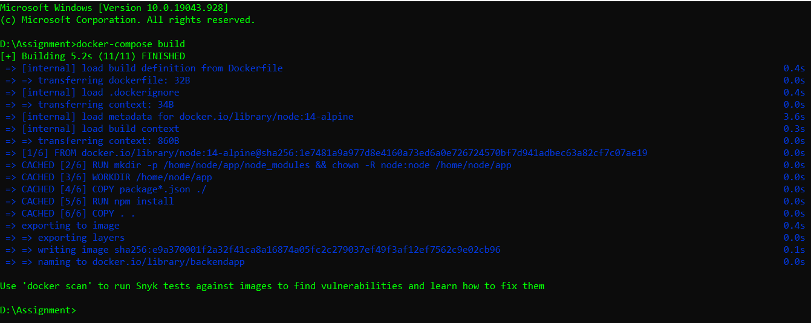
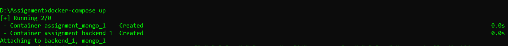
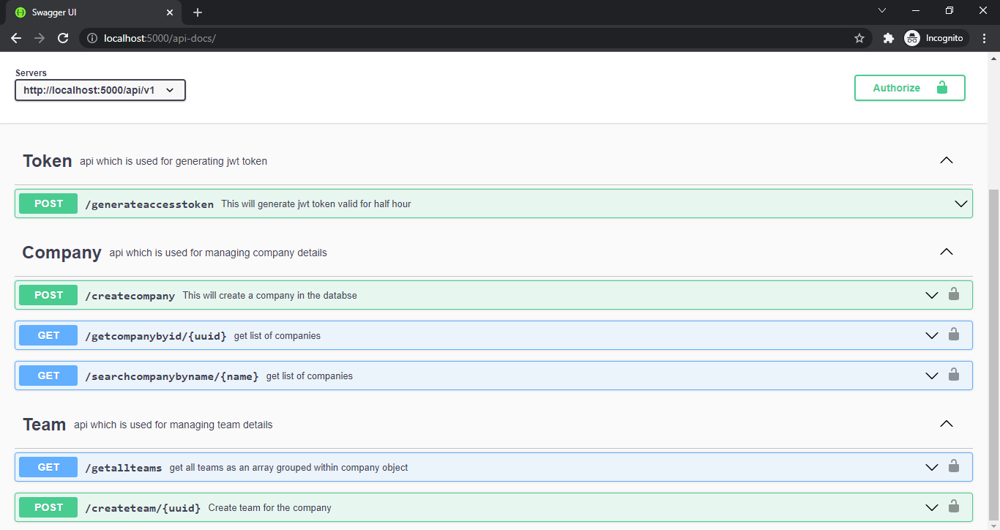
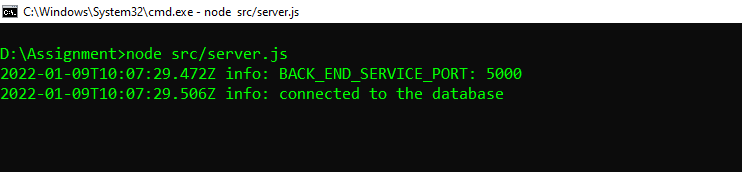

# Assignment for Nodejs Backend Developer
[](https://www.techwondoe.com/)
> Name --> Manoj Kumawat
> 
> Email --> imkumawatmanoj@gmail.com
> 
> Github --> https://github.com/imkumawat
> 
> Linkedin --> https://www.linkedin.com/in/imkumawat/
>
> Feel free to contact me!


# Swagger URL
- http://localhost:5000/api-docs/

# API Base URL
- http://localhost:5000/api/v1

# Functionality of APIs

- Generate JWT Access Token
- Create Company
- Create Team for a specific Company
- Get Company details by using Company uniuqe UUID
- Search Company details by using Company Name
- Get All Teams as an array grouped within Company object

# APIs Path

- /generateaccesstoken
- /createcompany
- /createteam/{uuid}
- /getcompanybyid/{uuid}
- /searchcompanybyname/{name}
- /getallteams

# Requirements

- Nodejs
- MongoDB 

# Running Server inside Docker
Make sure you have Dokcker installed in your system

Open terminal and clone this repository in your system

```sh
git clone https://github.com/imkumawat/Techwondoe.git
```
Open terminal in cloned project directory

- Check status of Docker
```sh
docker
```

- Build docker image
```sh
docker-compose build
```

- Running docker image
```sh
docker-compose up
```



Now, open chrome browser and hit the swagger url

http://localhost:5000/api-docs/


# Login credentials
__Username:__ Techwondoe

__Password:__ Techwondoe@2022

# Swagger UI



# Adding Authentication jwt token

- Generate new jwt access token by hitting **generateaccesstoken** api
- Copy jwt access token received in server response
- Click on top right corner **Authorized** button, this will open a pop window
- Paste the copied jwt access token and click on **Authorize** button
- Close the pop up window

# Using APIs
__All APIs setted with default inputs__
- Click on any API
- Click on __Try it out__
- Click on __Execute__ 
- And observe the __Server Response__

# Running Server in local machine

Installing the dependencies and devDependencies

- Open termial in parent directory and hit below command to install packages
```sh
npm install
```

Checking status of MongoDB service

- Open terminal and hit below command

```sh
mongo
```
Editing **.env** file
- File **.env** contain the default **DataBaseConnection String** that works with **docker mongo image**
- To work with in local system
- Open **.env** file to edit and change the value of **DB_CONNECTION_STRING** to "mongodb://127.0.0.1/techwondoe"
- Save it

Running the Server

- Hit the below command in the terminal

```sh
node src/server.js
```


Now, open chrome browser and hit the swagger url

http://localhost:5000/api-docs/
